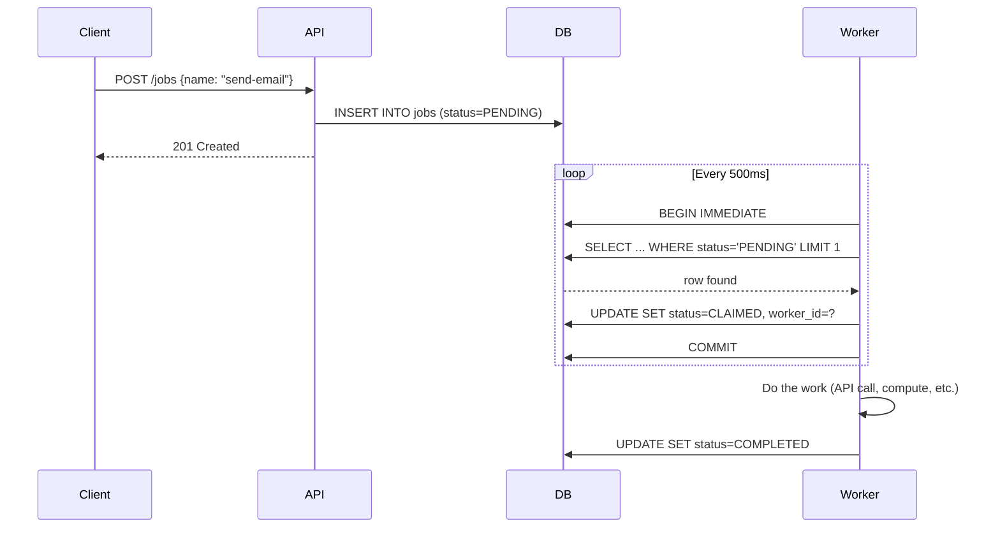
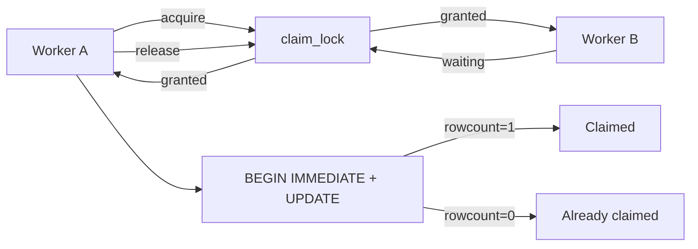
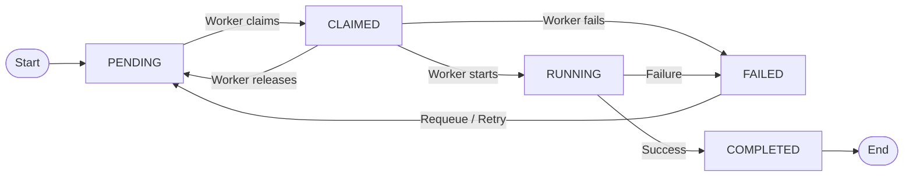
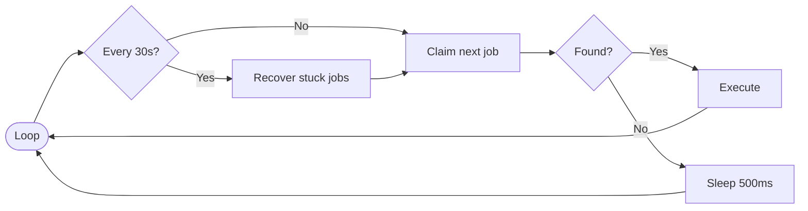
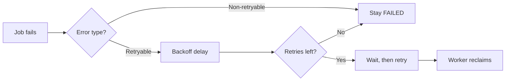

# Job Queue System

A job queue built with **FastAPI + SQLite** where background workers poll, claim, and execute jobs atomically.


## Quick Start

```bash
make install          # Install dependencies
make env              # create .env
make test             # Run all tests
make run              # Start server on port 8000
```

## Run with Docker

```bash
make docker-build     # Build image
make docker-run       # Run on port 8000
```

## Multi-Worker Setup

Each worker gets a unique ID: `worker-{PID}`.

```bash
# Single worker (default, with hot reload)
make run

# 4 worker processes
uv run uvicorn app.main:app --workers 4 --host 0.0.0.0 --port 8000
```

All workers share the same SQLite database. `BEGIN IMMEDIATE` ensures only one can write at a time. Each worker picks different jobs via `ORDER BY created_at ASC LIMIT 1` inside a serialized transaction.


## How It Works

1. **API** creates a job → stored in SQLite as `PENDING`
2. **Worker** runs a loop: every 500ms it polls the database for the next available job
3. Worker **claims** the job atomically (`BEGIN IMMEDIATE` + `WHERE status = 'PENDING'`) — only one worker wins
4. Worker **executes** the job, then marks it `COMPLETED` or `FAILED`
5. Failed jobs are **retried** with exponential backoff, up to `max_retries`



## Race condition — How Double-Claim Is Prevented



**Layer 1 — `threading.Lock`:** Prevents two threads in the same process from racing on the SELECT + UPDATE pair. Without it, Thread A could read a PENDING job, then Thread B reads the same row before A commits — both would try to claim it. The lock serializes access so only one thread at a time runs the claim sequence.

**Layer 2 — `BEGIN IMMEDIATE`:** SQLite's file-level write lock. When a transaction starts with `BEGIN IMMEDIATE`, it acquires a reserved write lock on the database file. Any other process trying to write will block until this transaction commits. This is what prevents two separate uvicorn worker processes from double-claiming the same job — even though they have separate `threading.Lock` instances.

**Together:** The `threading.Lock` is a fast in-process optimization that avoids unnecessary SQLite lock contention. The `BEGIN IMMEDIATE` is the real guarantee that works across processes. Even without the thread lock, the system would be correct — just slower under high concurrency.

## State Machine



Jobs flow through five states: `PENDING` → `CLAIMED` → `RUNNING` → `COMPLETED` or `FAILED`. Failed jobs can be retried back to `PENDING` via requeue or automatic retry with backoff. Each transition is enforced both at the service layer (`VALID_TRANSITIONS` dict) and at the database layer (`WHERE status = ?`).


## Worker Loop 



The worker runs an infinite loop: poll for a PENDING job, claim it atomically, execute it, and repeat. If no job is found, it sleeps and retries. Every 30 seconds it also checks for stuck jobs (CLAIMED/RUNNING for >5 min) and marks them FAILED so they can be retried.

## Retry with Exponential Backoff



**Formula:** `delay = min(1s × 2^attempt + jitter, 1 hour)`

| Attempt | 0 | 1 | 2 | 3 | 4 |
|---------|---|---|---|---|---|
| Delay | 1–2s | 2–3s | 4–5s | 8–9s | 16–17s |

**Why jitter?** Prevents thundering herd — if 100 jobs fail simultaneously, they won't all retry at the exact same moment.


