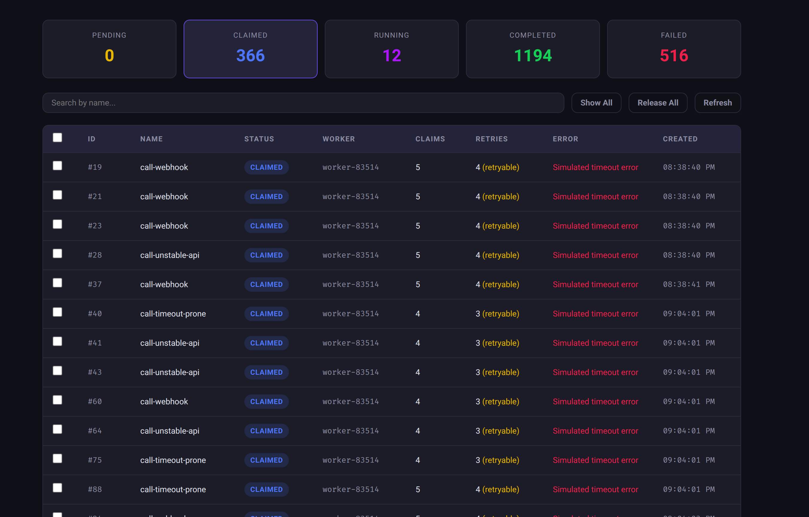
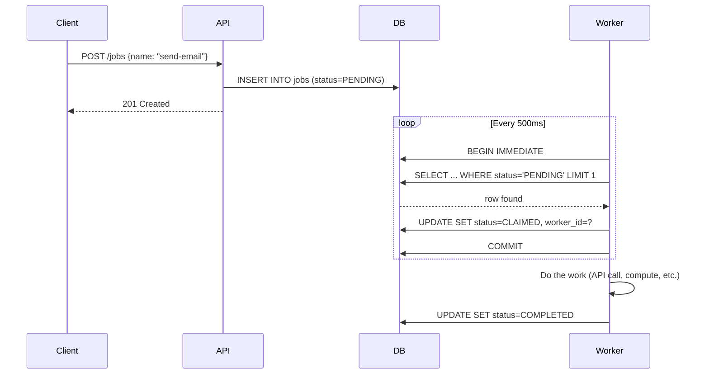
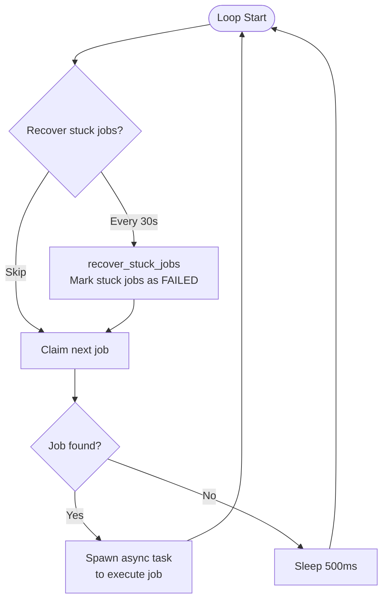
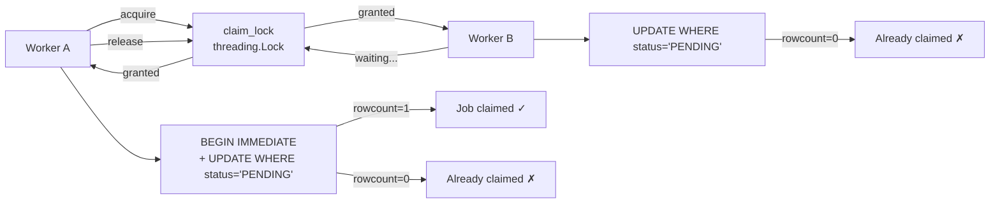
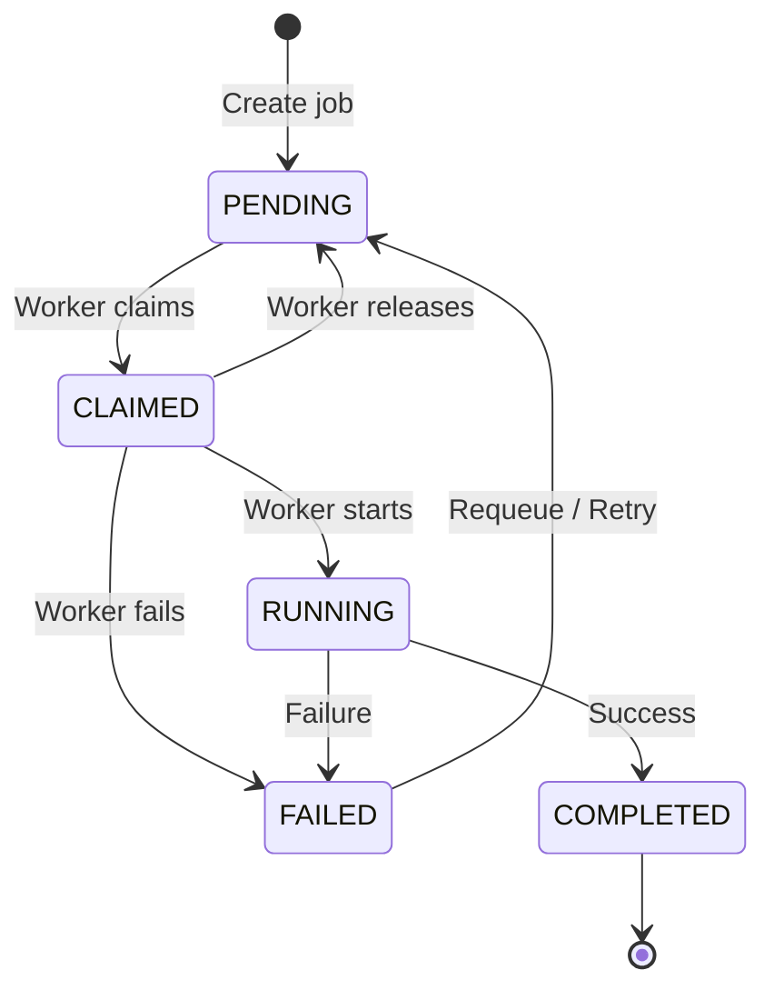
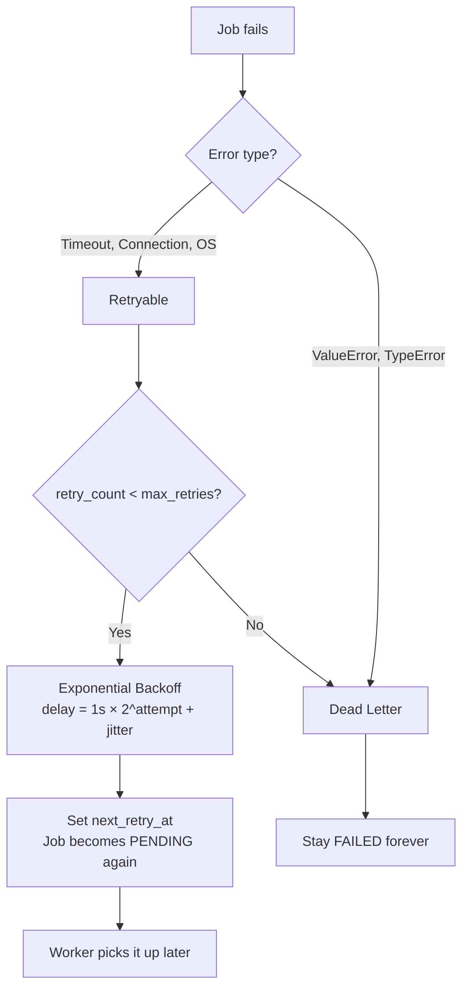
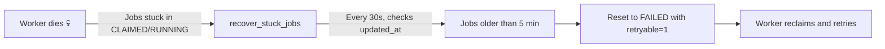
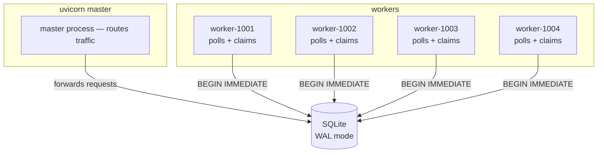

# Job Queue System

A job queue built with **FastAPI + SQLite** where background workers poll, claim, and execute jobs atomically. No message broker needed — just a database and smart SQL.



## How It Works (TL;DR)

1. **API** creates a job → stored in SQLite as `PENDING`
2. **Worker** runs a loop: every 500ms it polls the database for the next available job
3. Worker **claims** the job atomically (`BEGIN IMMEDIATE` + `WHERE status = 'PENDING'`) — only one worker wins
4. Worker **executes** the job, then marks it `COMPLETED` or `FAILED`
5. Failed jobs are **retried** with exponential backoff, up to `max_retries`



## Worker Loop — Step by Step

The `Worker` class runs inside the FastAPI process as an **asyncio task**. It does four things in a loop:



### The 4 Key Operations

| Step | What Happens | SQL |
|------|-------------|-----|
| **Recover** | Jobs stuck in CLAIMED/RUNNING for >5min are marked FAILED (worker probably died) | `UPDATE ... SET status='FAILED' WHERE status IN ('CLAIMED','RUNNING') AND updated_at < cutoff` |
| **Claim** | Pick the oldest PENDING job and atomically set it to CLAIMED | `BEGIN IMMEDIATE` → `SELECT ... WHERE status='PENDING'` → `UPDATE ... SET status='CLAIMED'` → `COMMIT` |
| **Execute** | Run the actual job logic (API call, data processing, etc.) | Application code |
| **Finish** | Mark job COMPLETED or FAILED (with retry logic) | `UPDATE ... SET status='COMPLETED'` or `UPDATE ... SET status='FAILED'` |

## Concurrency — How Double-Claim Is Prevented

Two layers of protection ensure a job is never claimed by two workers:



**Layer 1 — Python `threading.Lock`:** Only one thread can enter claim logic at a time within a single process.

**Layer 2 — SQLite `BEGIN IMMEDIATE`:** Acquires a write lock at the database level. Even across multiple processes (e.g., `uvicorn --workers 4`), SQLite serializes write transactions, so the `WHERE status = 'PENDING'` condition guarantees exactly one winner.

## State Machine



| Status | worker_id | Meaning |
|--------|-----------|---------|
| `PENDING` | `NULL` | Waiting in the queue |
| `CLAIMED` | set | Reserved by a worker, about to start |
| `RUNNING` | set | Worker is executing the job |
| `COMPLETED` | remains | Done successfully |
| `FAILED` | `NULL` | Permanently failed or retryable failure |

> When a job transitions to `COMPLETED`, `retryable` is set to `0` and `next_retry_at` is set to `NULL` — completed jobs never carry stale retry state.

## Retry with Exponential Backoff



**Formula:** `delay = min(1s × 2^attempt + random(0, 1s), 1 hour)`

| Attempt | Delay Range |
|---------|------------|
| 0 | 1–2s |
| 1 | 2–3s |
| 2 | 4–5s |
| 3 | 8–9s |
| 4 | 16–17s |

**Why jitter?** Prevents thundering herd — if 100 jobs fail at the same time, they won't all retry at the exact same moment.

## Worker Failure Handling

What happens when a worker process dies mid-job?



No external monitoring needed — the worker itself recovers stuck jobs from other (dead) workers every 30 seconds.

## Multi-Worker Setup

Each worker gets a unique ID based on its process ID: `worker-{PID}`.

```bash
# Single worker (default, with hot reload)
make run

# 4 worker processes
uv run uvicorn app.main:app --workers 4 --host 0.0.0.0 --port 8000
```



All 4 workers share the same SQLite database. `BEGIN IMMEDIATE` ensures only one can write at a time. Each worker picks different jobs because the claim query is `ORDER BY created_at ASC LIMIT 1` inside a serialized transaction.

## Quick Start

```bash
make install          # Install dependencies
make env              # create .env
make test             # Run all tests
make run              # Start server on port 8000
# or with multiple workers:
uv run uvicorn app.main:app --workers 4 --port 8000
```
