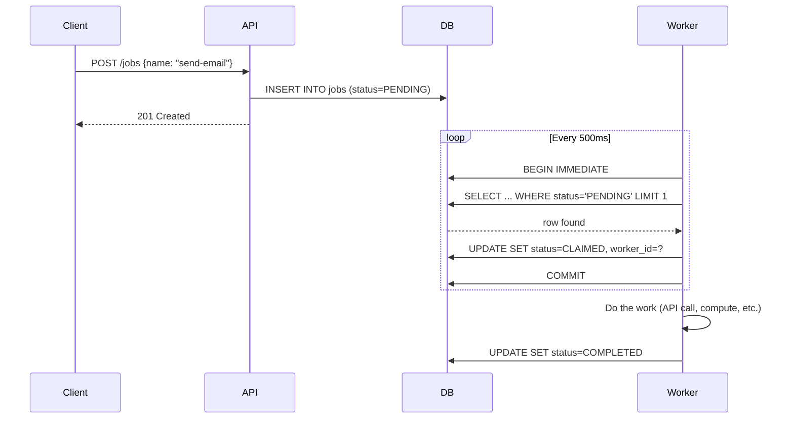
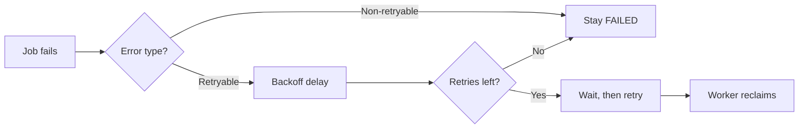
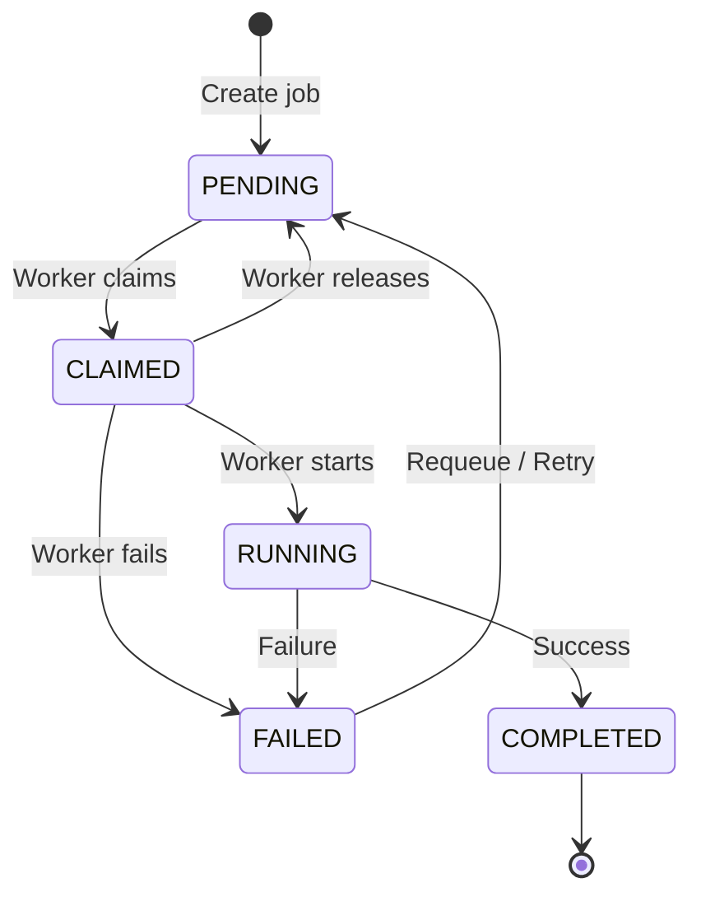
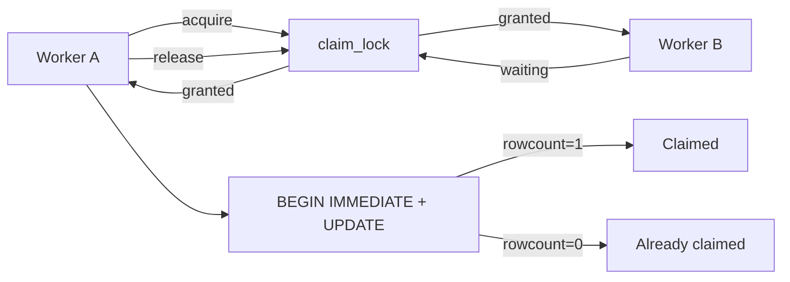

# Job Queue System

A job queue built with **FastAPI + SQLite** where background workers poll, claim, and execute jobs atomically.


## How It Works (TL;DR)

1. **API** creates a job → stored in SQLite as `PENDING`
2. **Worker** runs a loop: every 500ms it polls the database for the next available job
3. Worker **claims** the job atomically (`BEGIN IMMEDIATE` + `WHERE status = 'PENDING'`) — only one worker wins
4. Worker **executes** the job, then marks it `COMPLETED` or `FAILED`
5. Failed jobs are **retried** with exponential backoff, up to `max_retries`



## Worker Loop — Step by Step


| Step | What Happens |
|------|-------------|
| **Recover** | Jobs stuck in CLAIMED/RUNNING for >5min are marked FAILED |
| **Claim** | Pick oldest PENDING job, atomically set to CLAIMED with `BEGIN IMMEDIATE` |
| **Execute** | Run the actual job logic |
| **Finish** | Mark job COMPLETED or FAILED |

## Retry with Exponential Backoff



**Formula:** `delay = min(1s × 2^attempt + jitter, 1 hour)`

| Attempt | 0 | 1 | 2 | 3 | 4 |
|---------|---|---|---|---|---|
| Delay | 1–2s | 2–3s | 4–5s | 8–9s | 16–17s |

**Why jitter?** Prevents thundering herd — if 100 jobs fail simultaneously, they won't all retry at the exact same moment.

## State Machine



| Status | Meaning |
|--------|---------|
| `PENDING` | Waiting in the queue |
| `CLAIMED` | Reserved by a worker |
| `RUNNING` | Worker is executing |
| `COMPLETED` | Done successfully |
| `FAILED` | Permanently failed or retryable |

## Concurrency — How Double-Claim Is Prevented



**Layer 1 — `threading.Lock`:** One thread at a time per process.

**Layer 2 — `BEGIN IMMEDIATE`:** SQLite write lock across processes.

## Multi-Worker Setup

Each worker gets a unique ID: `worker-{PID}`.

```bash
# Single worker (default, with hot reload)
make run

# 4 worker processes
uv run uvicorn app.main:app --workers 4 --host 0.0.0.0 --port 8000
```

All workers share the same SQLite database. `BEGIN IMMEDIATE` ensures only one can write at a time. Each worker picks different jobs via `ORDER BY created_at ASC LIMIT 1` inside a serialized transaction.

## Quick Start

```bash
make install          # Install dependencies
make env              # create .env
make test             # Run all tests
make run              # Start server on port 8000
```
